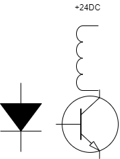

[TOC]

# Visit Meeting Memo
Hello world!
We will output Markdown to:

- HTML
- docx
- PDF
## Person

### Topic

# Heading 1
Ddd  🌹🦦
## Heading 2 text
  


|Time|Address|Person|
|--|--|--|
|9:00|Jinan|
we all know
$ F=ma $
$ E=m^2 c $
$$\int_1^{+\infty} f(x)dx$$
*Good meeting*
**good**
~~goal~~

 


1.项目1

[百度 1](http://www.baidu.com/)





2.two
3.three

<font face="黑体">我是黑体字</font>
<font face="微软雅黑">我是微软雅黑</font>
<font face="STCAIYUN">我是华文彩云</font>
<font color=#0099ff size=12 face="黑体">黑体</font>
<font color=#00ffff size=3>null</font>
<font color=gray size=5>gray</font>

* one
* two

1. one
2. one-1
3. two-2
4. two

* two-1
* two-2
* one
    * var x=1;
    * if then
        * yes
        * no
* two
    * int y
          * ok
        * 


*斜体*、_斜体_  
**加粗**  
***加粗+斜体***、**_加粗+斜体_**  
 ~~删除线~~    
==背景色==  
$\underline{下划线}$   
Superscript - superscript
^superscript^
Subscript - subscript
~subscript~  
<i>斜体</i>  
<b>加粗</b>  
<em>强调</em>  
<u>下划线</u>   
<del>删除</del>  
Z<sup>a</sup>  
Z<sub>a</sub>  
<kbd>Ctrl</kbd>
$$ x \href{why-equal.html}{=} y^2 + 1 $$
$ x = {-b \pm \sqrt{b^2-4ac} \over 2a}. $

**Advertisement :)**

- _[pica](https://nodeca.github.io/pica/demo/)_ - high quality and fast image
  resize in browser.
- __[babelfish](https://github.com/nodeca/babelfish/)__ - developer friendly
  i18n with plurals support and easy syntax.

You will like those projects!


上角标 30^th^
下角标 H~2~O

斜体：*XXX* <br>
加粗：**XXX**  <br> 
斜体加粗： ***XXX***  <br> 
删除： ~~XXX~~  <br>
分割线：***    ---

代码
```javascript
// An highlighted block
var foo = 'bar';
//
```
链接: [link](https://www.csdn.net/).

图片: 

带尺寸的图片: 

居中的图片: 

居中并且带尺寸的图片: 

超链接： [小狂神MarkDown](https://www.bilibili.com/video/BV12J41137hu?p=6)

> 箭头表示引用或者重要的话！

$\bar{x}$
$\ddot{y}$
$\iiint_{F}^{U} \, dx\,dy\,dz\,dt $
$\oint_{C} x^3\, dx + 4y^2\, dy$
${{Smallmath|f=  f(x)=5+\frac{1}{5} }}$

$\begin{vmatrix}
x & y \\
z & v \\
a & b
\end{vmatrix}$

这是一级页头标题
=============
 
这是二级页头标题
-------------
 
所有从事网络写作的人都应该尽快尝试上手 Markdown,它不仅会提高你的工作效率，更会让你专注于写作本身，保证文章的质量。这只是一个普通的段落.
 
这是另一个普通的段落.
 
### 这是三级页头标题
 
> 这是一个段落引用.
> 
> 这是引用中的第二段.
>
> ## 这是引用段落中的一个二级标题  

```flow
st=>start: 页面加载
e=>end: End:>http://www.google.com
op1=>operation: get_hotel_ids|past
op2=>operation: get_proxy|current
sub1=>subroutine: get_proxy|current
op3=>operation: save_comment|current
op4=>operation: set_sentiment|current
op5=>operation: set_record|current
 
cond1=>condition: ids_remain空?
cond2=>condition: proxy_list空?
cond3=>condition: ids_got空?
cond4=>condition: 爬取成功??
cond5=>condition: ids_remain空?
 
io1=>inputoutput: ids-remain
io2=>inputoutput: proxy_list
io3=>inputoutput: ids-got
 
st->op1(right)->io1->cond1
cond1(yes)->sub1->io2->cond2
cond2(no)->op3
cond2(yes)->sub1
cond1(no)->op3->cond4
cond4(yes)->io3->cond3
cond4(no)->io1
cond3(no)->op4
cond3(yes, right)->cond5
cond5(yes)->op5
cond5(no)->cond3
op5->e
 
```
java 是OPP语言[^1]

[^1]:脚注：
面向对象

  
- [ ] 一个任务列表元素
- [ ] 列表语法需求
- [ ] 正常的 **格式化**,@提示
- [x] 未完成的
- [ ] 完成的